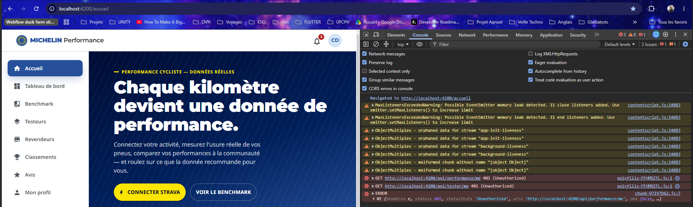

# Incompatibilités Frontend ↔ Backend

Document généré lors de l'intégration du frontend Angular avec le backend Express/Prisma.

> ✅ Toutes les discordances ont été corrigées le 2026-06-18.

---

## 1. Modèle `Tire` — champs de scores ✅

Adaptateur `adaptTire()` dans `TireService` — mapping `adhesion→scores.grip`, `efficiency→scores.energyReturn`.

---

## 2. Modèle `TireWear` — champ `position` ✅

**Correction :** Champ `position String @default("front")` ajouté au modèle Prisma `TireWear`.
- `WearService.createWear()` accepte et stocke `position`
- `adaptWear()` lit maintenant `b.position` au lieu d'inférer par index
- Seed : `front` pour le premier pneu, `rear` pour le second

---

## 3. Modèle `Reward` — champs `title` et `description` ✅

**Correction :** Champs `title String @default("")` et `description String @default("")` ajoutés au modèle Prisma `Reward`.
- Seed mis à jour avec des titres et descriptions réels par type de récompense
- `adaptUser()` et `getRewards()` lisent maintenant les valeurs du backend (fallback sur génération si vide)

---

## 4. Modèle `TesterReward` — champs `requiredKm` et `icon` ✅

**Correction :** Champs `requiredKm Float @default(0)` et `icon String @default("star")` ajoutés au modèle Prisma `TesterReward`.
- Seed mis à jour avec les km requis par palier et des icônes distinctes (`award`, `star`, `trophy`, `crown`)
- `adaptProgress()` lit maintenant `r.requiredKm` et `r.icon` depuis le backend

---

## 5. Benchmark pneus concurrents ✅

**Correction :** 4 pneus concurrents seedés (`brand: 'Concurrent'` — Continental, Vittoria, Schwalbe, Pirelli).
- `getBenchmarkData()` filtre maintenant réellement Michelin vs Concurrent via `/api/tires`

---

## 6. `TireTerrainStats.avgPunctureRate` ✅

**Correction :** Champ `avgPunctureRate Float @default(0)` ajouté au modèle Prisma `TireTerrainPerf`.
- Seed mis à jour avec des taux de crevaison réalistes par catégorie
- `adaptTerrainPerf()` lit maintenant `b.avgPunctureRate` depuis le backend

---

## 7. `ReviewKpis.recommendationPct` ✅

**Correction :** Champ `recommended Boolean @default(false)` ajouté au modèle Prisma `Review`.
- `ReviewsService.getKpis()` calcule `recommendationPct` à partir du vrai champ `recommended`
- Seed : `recommended: true` pour les avis avec `rating >= 4`
- Interface `BackendKpis` alignée — plus de mapping `fiveStarPct → recommendationPct`

---

## 8. `UserBadge.unlocked` — badges verrouillés ✅

**Correction :** Endpoint `GET /api/users/me/badges/all` créé.
- `UsersService.getAllBadgesWithStatus(userId)` retourne tous les badges avec `unlocked: boolean`
- `UserService.getAllBadges()` côté frontend appelle ce nouvel endpoint

---

## 9. `DealerService.distanceKm` ✅

**Correction :** `DealerService` côté frontend demande la géolocalisation navigateur et passe `lat`/`lng` au backend.
- Le backend calculait déjà `distanceKm` via Haversine quand `lat`/`lng` sont fournis
- Les revendeurs sont triés par distance croissante si la géolocalisation est accordée

---

## Routes manquantes — résolues

| Route | Utilisée par | Statut |
|---|---|---|
| `GET /api/users/me/badges/all` | `UserService.getAllBadges()` | ✅ Créée |
| `GET /api/dealers/?lat=&lng=` | `DealerService.getNearbyDealers()` | ✅ Fonctionnelle (géo ajoutée côté frontend) |
